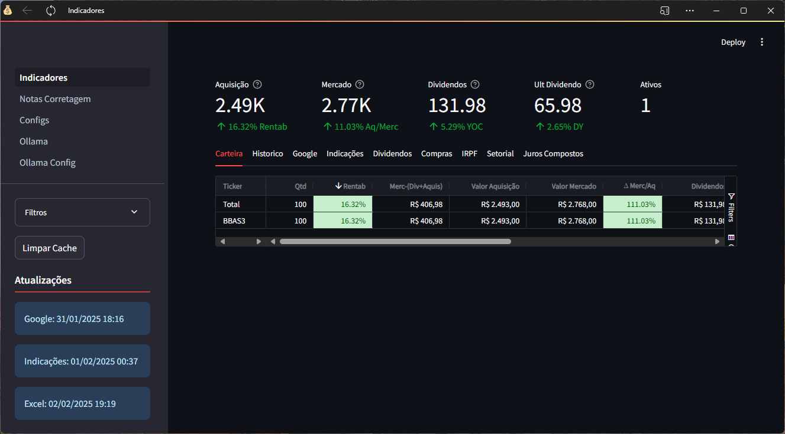

## Do Excel 🗂️ para o Python 💸


## Por onde começar

1. Clone o repositório do git https://github.com/wagnerpiressilva/python-streamlit.git

2. Altere as configurações do arquivo [Configs.ini](https://github.com/wagnerpiressilva/python-streamlit/blob/main/Configs.ini) com os locais do seu computador.  
```
[Aba_Indicacoes]
arquivo_excel = arquivos/indicacoes.xlsx
[Aba_Google]
url = https://docs.google.com/spreadsheets/d/e/2PACX-1vSxImJbqEL9G2lpM6nfjTGgf7x7lPCQa6NVdRE1dt3w5NvJ1O8LiqFJaWRT0cEVeH0LNC2uH3JafWd3/pub?gid=0&single=true&output=csv
[Aba_Historico]
arquivo_excel = arquivos/cadastro_historico.xlsx
```
3. Instale as dependências do python (No terminal dentro da pasta raiz do repositório execute)
```
pip install -r requirements.txt
```
4. Execute página inicial do aplicativo
```
streamlit run 1_Indicadores.py
```
Se tudo correr bem você deve ter uma tela igual a essa:


## Mensagem do autor
Espero que esse código te inpire nos estudos de python e na sua jornada em busca da independência financeira.

❤️ por [Wagner Pires](mailto:wagnerpires@gmail.com) 😊
